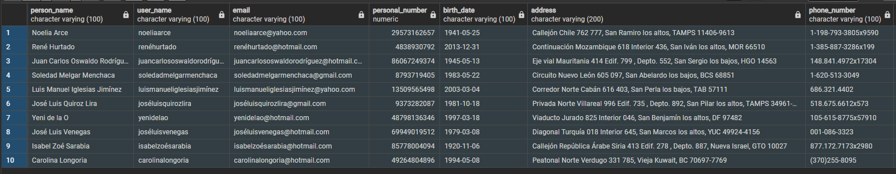
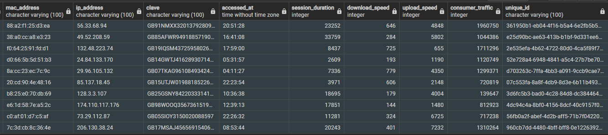
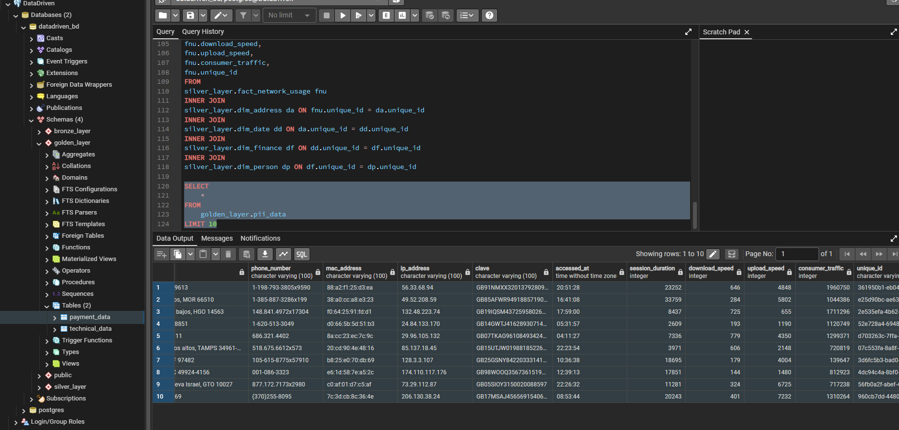
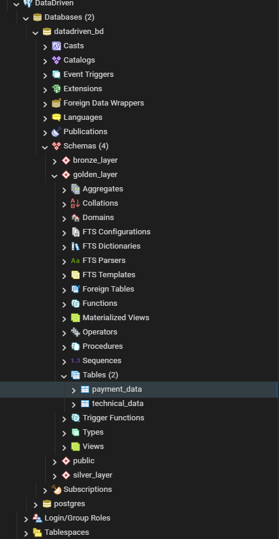

# Big Data CrashCourse [MX] – Módulo 2

## Descripción

En este módulo del curso de SoftServe se trabajó con generación y procesamiento de datos tipo PII (información personal identificable).

Se generaron datos sintéticos en formato CSV usando Python con localización en español (`es_MX`) y posteriormente se cargaron en PostgreSQL para su procesamiento por capas hasta la consulta final en `golden_layer`. También se realizaron validaciones de calidad como revisión de nulos y duplicados.

---

## Tecnologías utilizadas

- Python 3
- PostgreSQL / pgAdmin
- Git / GitHub

---

## Base de datos

**Nombre:** `datadriven_bd`

### Estructura de schemas y tablas

```
datadriven_bd
│
├── public
│   └── batch_first_load
│
├── bronze_layer
│   └── batch_first_load
│
├── silver_layer
│   ├── dim_address
│   ├── dim_date
│   ├── dim_finance
│   ├── dim_person
│   └── fact_network_usage
│
└── golden_layer
    ├── payment_data
    └── technical_data
```

---

## Capas del proceso

| Capa | Descripcion |
|---|---|
| `public` | Carga inicial de datos crudos (batch_first_load) |
| `bronze_layer` | Datos ingestados sin transformacion |
| `silver_layer` | Datos limpios y normalizados en tablas dimensionales y de hechos |
| `golden_layer` | Datos listos para consumo y analisis |

---

## Evidencia

### Resultado de la query final
```sql
SELECT * FROM golden_layer.pii_data LIMIT 10;
```





### Vista general



### Estructura y contenido


